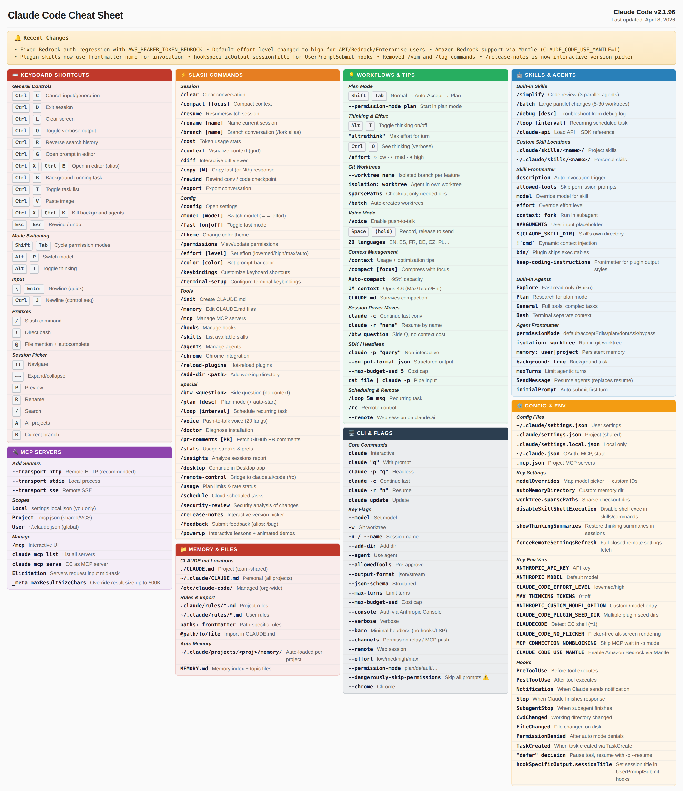

# Claude Code Live Cheatsheet

> Self-updating visual reference for [Claude Code](https://claude.com/code).
> Refreshed every 5 minutes from the official [CHANGELOG](https://github.com/anthropics/claude-code/blob/main/CHANGELOG.md).

**[Live interactive version →](https://defaultperson.github.io/claude-code-live-cheatsheet/)**

## How It Works

1. GitHub Actions checks npm for new Claude Code releases every 5 minutes
2. Claude AI parses the [CHANGELOG](https://github.com/anthropics/claude-code/blob/main/CHANGELOG.md) and updates [`cheatsheet.json`](cheatsheet.json)
3. Auto-generates: [PNG](cheatsheet.png), [interactive HTML](https://defaultperson.github.io/claude-code-live-cheatsheet/), [RSS](https://defaultperson.github.io/claude-code-live-cheatsheet/feed.xml)

## License

MIT
